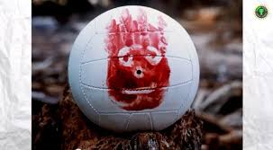
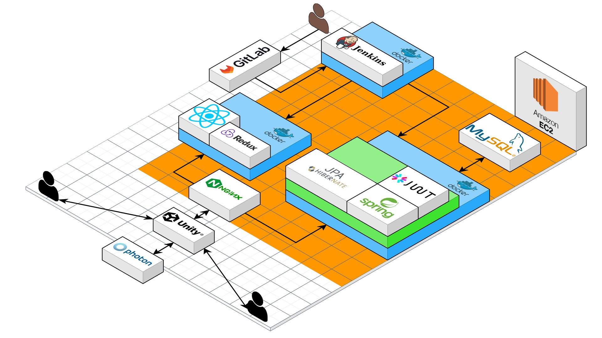
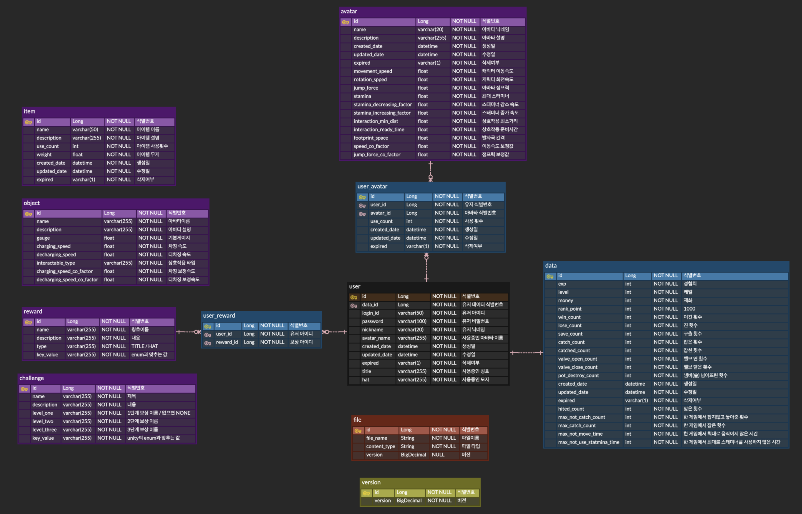
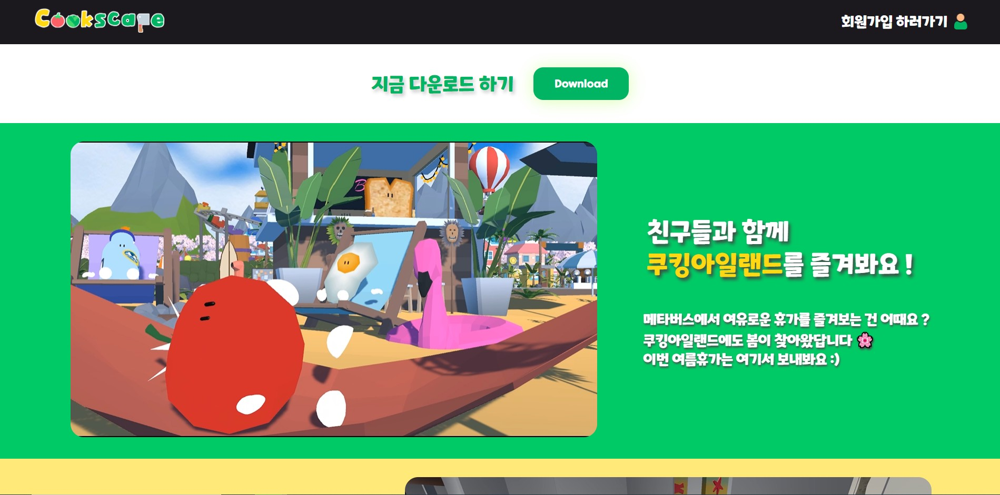

# 쿡스케이프 

####

✏ <b>프로젝트명</b> 

- Cookscape(쿡스케이프)

 

✨ <b>서비스 특징</b> 

- 4:1 비대칭 서바이벌 술래잡기 게임
- 유저간 실시간 소통이 가능한 메타버스 로비
- 다양한 업적 및 보상시스템

 

👤 <b>서비스 대상</b> 

- 여러 사람들과 함께 긴장감 넘치는 술래잡기 게임을 하고 싶은 사람

- 아기자기한 마을에서 친구들과 추억을 만들고 싶은 사람

 

☝🏻 <b>주요 기능</b>

1. 대기 단계에서 유저 간 실시간 소통, 이벤트, 상호작용으로 재미있는 사용자 경험 제공

- 다수의 어트랙션 탑승 가능
- 유저끼리 채팅으로 소통 가능

2. 특색있는 컨셉과 직관적인 규칙으로 재치있는 긴장감 유도
3. 귀여운 플레이어 캐릭터로 진입장벽 완화

- 메타버스에서 즐길 수 있는 다양한 캐릭터와 착용 가능한 모자(아바타) 제공

 

👑 <b>주요 기술</b>
<!-- 필수 항목 -->

| Application                          | Domain                                | Language                         | Framework                            | Game Engine                  |
| ------------------------------------ | ------------------------------------- | -------------------------------- | ------------------------------------ | ---------------------------- |
| :black_square_button: Desktop Web    | :black_square_button: AI              | :white_check_mark: JavaScript    | :black_square_button: Vue.js         | :white_check_mark: Unity     |
| :black_square_button: Mobile Web     | :black_square_button: Big Data        | :black_square_button: TypeScript | :white_check_mark: React             | :black_square_button: UnReal |
| :black_square_button: Responsive Web | :black_square_button: Blockchain      | :white_check_mark: C/C++      | :black_square_button: Angular        | :black_square_button:        |
| :black_square_button: Android App    | :black_square_button: IoT             | :white_check_mark: C#         | :white_check_mark: Node.js        | :black_square_button:        |
| :black_square_button: iOS App        | :black_square_button: AR/VR/Metaverse | :black_square_button: Python     | :black_square_button: Flask/Django   | :black_square_button:        |
| :white_check_mark: Desktop App       | :white_check_mark: Game               | :white_check_mark: Java          | :white_check_mark: Spring/Springboot | :black_square_button:        |
|                                      |                                       | :black_square_button: Kotlin     |                                      | :black_square_button:        |

 
<!-- 필수 항목 -->
- photon의 Remote Procedure Calls으로 메타버스 및 인게임에서 유저간 실시간 동기화 원활하게 제공

- Occlusion Culling 및 카메라 렌더링 거리 조절로 최적화

- 직접 제작 및 편집한 애니메이션, 모델링, 리깅, GUI 다수

 

🧵 <b>기술 스택</b> 

- Game Client : 
  - Unity Client
 
- Game Server : 
  - Photon Server
 
- 프론트엔드 : 
  - React.js
 
- 백엔드 : 
  - Java 
  - Spring Boot
 
- DB : 
  - MySQL
 
- Infra :
  - Jenkins 
  - Docker

 

🎠 <b>배포 환경</b>

- URL : https://j8b109.p.ssafy.io/
- 테스트 계정 : 
  - ID - admin, PW - ssafyadmin
- [포팅 메뉴얼](./exec/Cookscape_포팅_매뉴얼.pdf)

🗓 <b>진행 일정</b> 

- 23.02.20 ~ 23.04.07 (총 7주)

 
<!-- 자유 양식 -->

### 팀 소개 - x를 눌러 조

| 이지우                   | 서현경                        | 김이슬                    | 이진혁                       | 임경찬                        | 이정현                         |
| ------------------------ | ----------------------------- | ------------------------- | ---------------------------- | ----------------------------- | ------------------------------ |
|  |  |  |  |  |  |
| 팀장, Client             | Client UI                     | Client Map                | BackEnd                      | Game Server                   | Client                         |

 
<!-- 자유 양식 -->

## 프로젝트 상세 설명 

#### <b>게임 설명/주요 기능</b>

#### 기획/설계

##### 🛠 <b>아키텍처</b>

##### 💾 <b>[ERD]()</b>

##### 🎨 <b>[와이어 프레임](https://www.figma.com/file/CHy5mHE2huckKXflhWVSMf/META?node-id=55:2&t=AuAQx9A9tMYYLNDt-1)</b>

 
<!-- 서비스 시연 -->

## 서비스 구현 내용

##### 🎁 메인 페이지

##### 📱 메타버스 화면

##### 🥗 게임 화면

